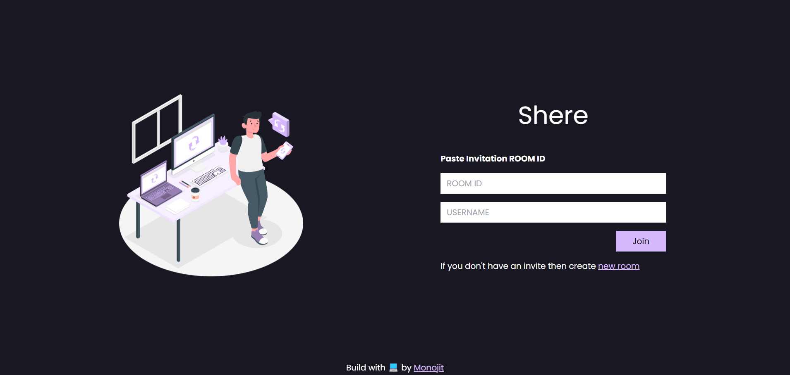

# Code Sync - A Realtime Code Editor




[]()
[]()
[]()
[]()
[]()
[]()
[]()
[]()

Code Sync is a collaborative, real-time code editor where users can seamlessly code together. It provides a platform for multiple users to enter a room, share a unique room ID, and collaborate on code simultaneously.

## 🔮 Features
- Real-time collaboration on code editing
- Unique room generation with room ID for collaboration
- Syntax highlighting
- Instant updates and synchronization of code changes
- Notifications for user join and leave events

## 💻 Tech Stack
### 🖥️ Frontend
- **React JS:** A JavaScript library for building user interfaces, facilitating the creation of dynamic and efficient web applications.
- **React Router:** Enables navigation and routing in React applications, managing the UI based on the URL.
- **Tailwind CSS:** A utility-first CSS framework that streamlines the styling process with pre-defined classes.
- **Vite:** A build tool for modern web development, providing faster development and better performance.
- **PropTypes:** Runtime type checking for React props, helping to catch bugs early in development.
- **UUID:** Generates unique identifiers, useful for key assignments in databases or component instances.
- **Socket.io-client:** Implements real-time communication between the client and server using WebSockets.
- **React-hot-toast:** A React library for creating customizable and responsive toast notifications.
- **React-avatar:** Simplifies the display of avatars or profile pictures in React applications.
- **CodeMirror:** A versatile text editor implemented in JavaScript for embedding in web applications.

### 🌐 Backend
- **Node.js:** A server-side JavaScript runtime, allowing the execution of JavaScript code outside the browser.
- **Express:** A web application framework for Node.js, simplifying the creation of robust and scalable APIs.
- **Socket.io:** Facilitates real-time bidirectional communication between clients and servers using WebSockets.
- **Dotenv:** Loads environment variables from a .env file, enhancing the configuration of Node.js applications.
- **CORS:** Stands for Cross-Origin Resource Sharing, a mechanism that permits or restricts web page access to resources on another domain.


## 📂 Folder Structure
```
client/
├── public/
│      └──style.css
├── src/
│   ├── actions/
│   │   └── Actions.js
│   ├── assets/
│   ├── components/
│   │   ├── EditorPage/
│   │   │   ├── Client.jsx
│   │   │   ├── Editor.jsx
│   │   │   ├── MenuButton.jsx
│   │   │   └── Sidebar.jsx
│   │   ├── Home/
│   │   │   ├── Footer.jsx
│   │   │   └── FormComponent.jsx
│   │   └── Loading.jsx
│   ├── context/
│   │   └── ContextProvider.jsx
│   ├── hooks/
│   │   └── useSocket.js
│   ├── layouts/
│   │   └── EditorLayout.jsx
│   ├── pages/
│   │   ├── EditorPage.jsx
│   │   └── Home.jsx
│   ├── App.jsx
│   ├── index.css
│   ├── main.jsx
│   └── socket.js
├── .env
├── .eslintrc.cjs
├── .gitignore
├── index.html
├── package-lock.json
├── package.json
├── tailwind.config.js
└── vite.config.js

server/
├── actions/
│   └── Actions.js
├── .gitignore
├── Actions.js
├── package-lock.json
├── package.json
└── server.js

README.md
```

## ⚙️ Installation
1. **Clone the repository:**
   ```bash
   git clone https://github.com/FlowerC9/Shere
   ```
2. **Set .env file:**
    Inside the client and server directory, create or edit the .env file and add the following line:  
    Frontend:
    ```bash
    VITE_BACKEND_URL=<your_server_url>
    ```
    Backend:
    ```bash
    PORT=3000
    ```

1. **Install dependencies:**
    Navigate to the frontend and backend directories separately and run:
   ```bash
    npm install
   ```
2. **Start the frontend and backend servers:**  
    Frontend:
    ```bash
    cd client
    npm run dev
    ```
    Backend:  
    ```bash
    cd server
    npm run dev
    ```
3. **Access the application:**
   Open a browser and enter the following URL:
   ```bash
   http://localhost:5173/
   ```

## 🔮 Features for next release
- Implementation of syntax highlighting across various programming languages 
- Multiple themes for editor


## ✍️ About Developer
- Monojit Tewari (Aspiring Full Stack Developer)    
[](https://github.com/FlowerC9)
[](https://linkedin.com/in/Monojit-Tewari)